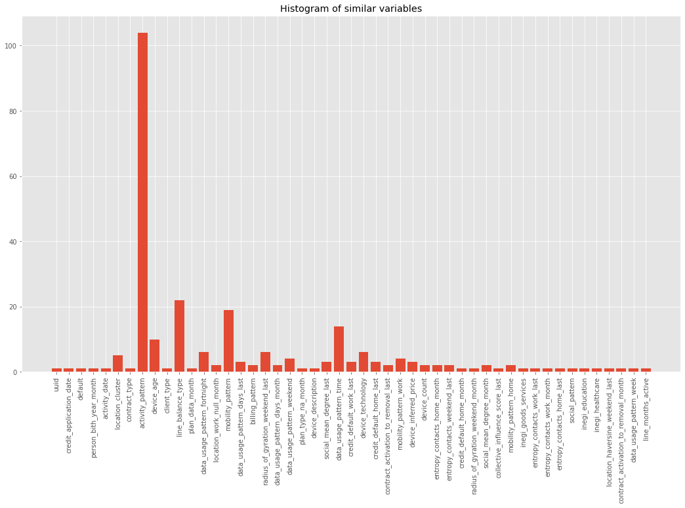
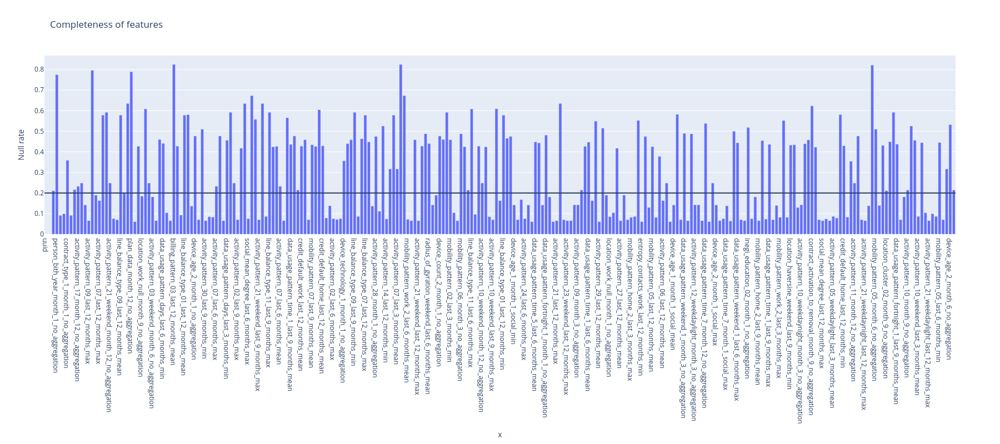
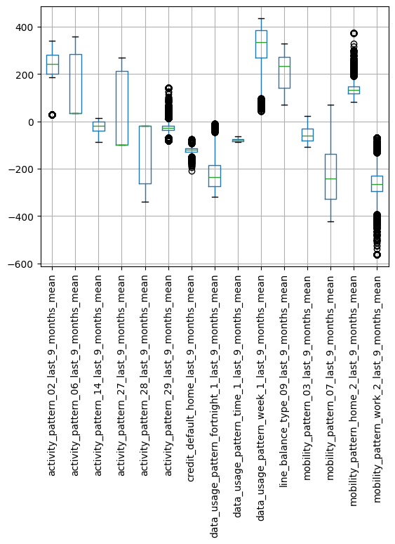
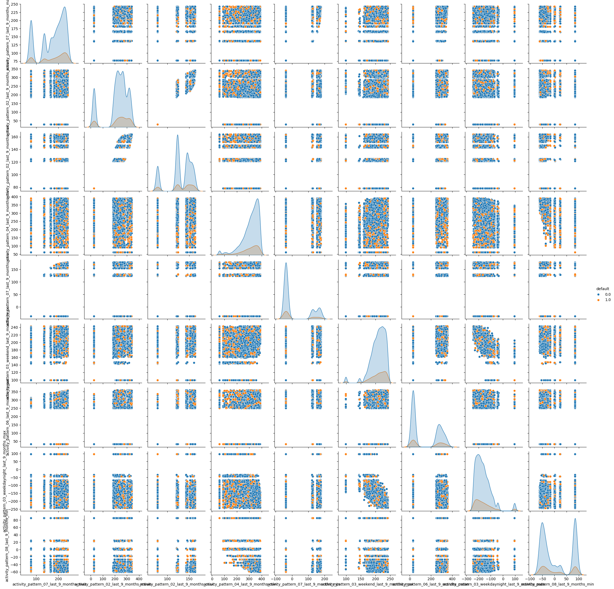
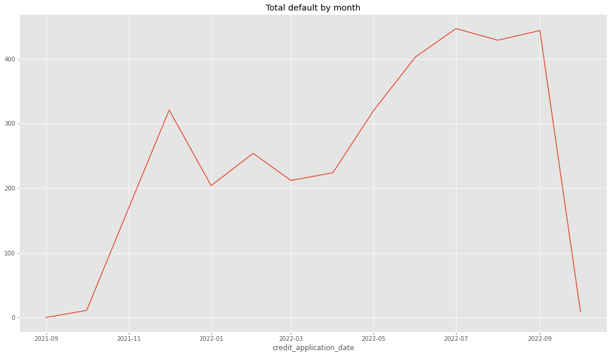
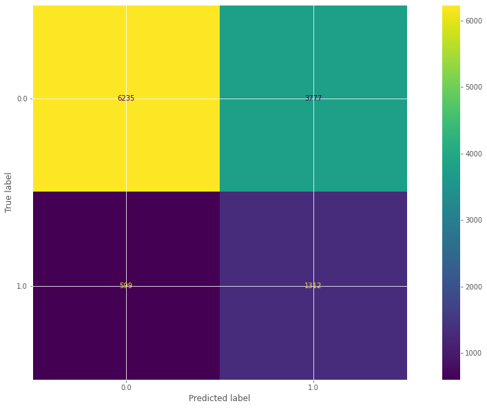
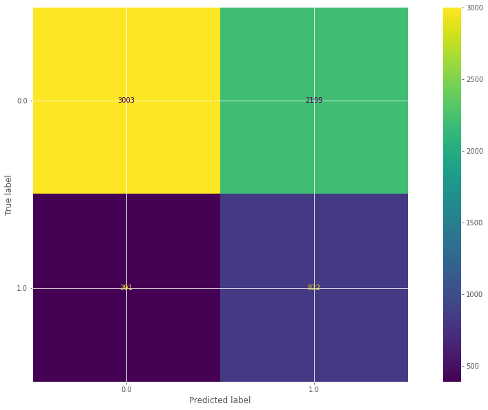

# Loan Default Prediction

<h1 align="center">
  
  <br>
</h1>

### Table of Contents  

[Resumen](#Resumen) <br>
[Análisis](#EDA) <br>
[Preprocesamiento](#Preprocesamiento) <br>
[Modelación](#Modelación) <br>
[Resultados](#Resultados) <br>
[Trabajo_futuro](#Trabajo_futuro) <br>

<a names= "Resumen"></a>

## Resumen

En este proyecto se implemetó modelo de regresión logística entrenado para la detección de incumplimiento de un préstamo, siendo este un problema de clasificación binaria. 
Además de los parámetros del modelo, se tienen organizados y distribuidos los recursos para el análisis exploratorio (EDA), preprocesamiento y entrenamiento. Los detalle de cada sección se describen con detalle en este mismo texto.

La justificación de seleccionar la regresión logística es debido a su buen desempeño en clasificación binaria, en la interpretabilidad del modelo y en la capacidad de ajustar pesos sobre las clases en problemas desbalanceados, principalmente, incluso si existen otros modelos que tengan un mayor poder predictivo, en este estudio el enfoque es más a mostrar diferentes técnicas para mejorar el desempeño de un modelo que de obtener una buena métrica.

<a names= "EDA"></a>

## Análisis explotario de datos (EDA)

En el análisis exploratorio se revisaron con cuidado los registros del conjunto de datos "definitely_not_from_kaggle_loan_default_dataset.csv". La principales tareas de análisis se pueden agrupar en la serie de pasos siguientes.

<ol>
<li> Revisión de las características (Tipo de dato, nombres, similitudes) </li>
<li> Revisión del porcentaje de valores nulos por variable </li>
<li> Revisión de la completez de la información por registro </li>
<li> Correlación entre las variables </li>
</ol>

También se revisan estadísticos sobre las variables, distribución de los datos, manejo de valores atípicos, entre otros procedimientos. En el notebook EDA.ipynb se encuentran la exploración más importante y se eliminó el código que no llevó a ningún descubrimiento relevante.

---
> [!NOTE] 
> El conjunto de datos no cuenta con un diccionario por lo que se desconoce el origen y la importancia a priori de las variables a analizar. El conocimiento inicial permite un mejor estudio de las variables y la posibilidad de desarrollar nuevas variables por medio de ingeniería.

---

A continuación se describen los principales hallazgos encontrados en el análisis exploratorio, estos se resumen en la siguiente lista y se describen posteriormente.

<ul>
<li> Clases: </li> 
<li> Registros nulos: </li>
<li> Familias de variables: </li> 
<li> Variables seudocontinuas </li>
<li>  Correlación </li>
<li> Outliers </li>
<li> Distribución </li>
<li> Regiones </li> 
<li> Distribución de incumplimiento </li>
</ul>

**Insights**

<ul>
<li> <b>Clases: </b></li> Es un problema binario con clases desbalanceadas, la proporción es como sigue

|Default| Porcentaje|
|--|--|
|1| 17%|
|0| 83%|

<li> <b>Registros nulos: </b></li> Existen registros con más del 90% de valores nulos, esto es un problema respecto a la calidad del dato. Se requiere un estudio más minucioso sobre este subcojunto.
<li> <b>Familias de variables: </b> </li> Existen familias de variables con varios tipos principales, algunas con métricas agregadas (min, max, mean, no agg). De estas familias se encuentra que la mayor es la relacionada al nombre "activity_pattern" con 104 variables similares. 
<h1 align="center">
  
  <br>
</h1>
<li> <b>Variables seudocontinuas</b> </li> Se encontró que un proporción considerable de variables supuestamente continuas tienen valores fijos y con una baja cantidad de únicos. Por ejemplo, "activity_pattern_09_last_9_months_max" que cuenta solo con 23 valores únicos.
<li> <b> Tasa de valores faltantes </b> </li>Aproximadamente la mitad de las variables presentan un porcentaje mayor al 20% de valores nulos.
<h1 align="center">
  
  <br>
</h1>
<li> <b> Correlación </b> </li> Hay una alta incidencia de correlación entre las variables de las mismas familias. Donde para las variables con menos del 20% de valores nulos se tienen las siguientes incidencias entre variables con los mismos nombres base. 

```python
{'mobility_pattern_work_': 5,
 'activity_pattern_': 249,
 'device_inferred_price_': 1,
 'social_mean_degree_last_': 3,
 'entropy_contacts_weekend_last_': 1}
```
<li> <b> Outliers </b> </li> Existe una presencia alta de valores atípicos en varias variables. A continuación se muestra una ejemplo para variables agregadas por la media aritmética

<h1 align="center">
  
  <br>
</h1>

<li> <b> Distribución </b> </li> Los datos presentan distribuciones por bloques, mostrando que los datos no se distribuyen continuamente sobre todo el dominio. Se pueden apreciar este tipo de aglomeraciones en las variables "activity_pattern"

<h1 align="center">
  
  <br>
</h1>


<li><b> Regiones </b> </li> Se encontró que hay un porcentaje similar de incumplimientos por región, siendo entonces que no existe una diferenciación clara por geografía respecto al incumplimiento del pago del préstamo.

|Región|default|
|--|--|
|6|0.112782|
|8|0.149629|
|4|0.12987|
|7|0.141616|
|3|	0.12311|
|1|0.134247|
|2|0.146296|
|5|0.129139|
|9|0.130252|

<li> <b> Distribución de incumplimiento </b> </li> El incumplimiento no se distribuye uniformemente sobre el tiempo, siendo particularmente notorio en el último mes del conjunto etiquetado.

<h1 align="center">
  
  <br>
</h1>
</ul>

<a names= "Preprocesamiento"></a>

## Preprocesamiento

El preprocesamiento se dividió en 3 secciones con una condición inicial sobre los datos, dicha condición consiste en tratar por separado (trabajo a futuro) los registros con alta nulicidad. Por lo que una cantidad de registros baja se separó para su propio estudio posterior.

Las secciones en orden de implementación son,

<ul>
<li> Separación de conjuntos </li>
<li> Selección de variables </li>
<li> Transformaciones</li>
</ul>

A continuación se detalla el procedimiento,

<ul>
<li> <b> Separación de conjuntos: </b> </li> El conjunto de entrenamiento y validación se separó considerando la dependencia temporal de las predicciones sobre el conjunto de prueba (muestras sin etiqueta). Considerando esta necesidad, se separaron 10 meses para el conjunto de entrenamiento y 4 meses para el conjunto de validación. 

La distribución de incumplimiento para ambos conjuntos es similar

**Conjunto de entrenamiento**

|default| Proporción de la clase|
|--|--|
|0| 0.839722 |
|1|0.160278 |


**Conjunto de validación**

|default| Proporción de la clase|
|--|--|
|0| 0.80965  |
|1|0.19035 |

La distribución del total de registros entre conjuntos es aproximadamente del 70%-30% para entrenamiento y validación respectivamente.

<li> <b> Selección de variables: </b> </li> Se realizaron procedimientos para la exclusión de variables según las siguientes condiciones.
<ul> 
<li> Variables no deseadas: </li> Se excluyeron varias que no son deseadas desde el inicio del estudio como el id del registro o la fecha en la que se registró el crédito, esta última para evitar la dependecia del modelo respecto al tiempo.
<li> Variables quasi-constantes: </li> Las variables con baja varianza, generalmente, tienen poco impacto en la implementación de los modelos ML.
<li> Variables con alto porcentaje de valores nulos: </li> Se retiraron las variables que presentaban una proporción mayor al 20% de valores nulos, considerando que restaban más de la mitad de las variables haciendo dicha exclusión.
<li> Variables correlacionadas: </li> Se excluyeron las variables con una correlación mayor al 0.8 según el método clásico de Pearson. Si hay correlación en una relación uno a muchos se retiene la primer variable encontrada. Más información del método se puede consultar el la documentación de <a href = "https://feature-engine.trainindata.com/en/latest/index.html">Feature engine</a>.
</ul>
<li> <b> Creación de variables: </b> </li> Este procedimiento no se realizó en este estudio por falta de definición de las variables.
<li><b>  Transformaciones: </b> </li> Se realizaron 2 transformaciones principales.
<ul> 
<li> One hot encoder: </li> La variable de regiones se transformó utilizando OneHotEncoder por si el modelo selecciona alguna de estas regiones siguiendo el algoritmo RFE (Se revisa en la implementación)
<li> Imputación: </li> Se imputaron los valores faltantes para las variables seleccionadas siguiendo el algoritmo de KNN, la razón principal fue la no continuidad de los valores de las variables y la presencia de aglomeraciones de datos.
</ul>
</ul>

Finalmente se preservan los conjuntos de datos limpios para la posterior implementación del modelo.

<a names= "Modelación"></a>

## Modelación

**Descripción matemática**

Se implementó un modelo de regresión logística para la clasificación del incumplimiento de pago. La ecuación que rige el modelo es

$$
f(x) = \dfrac{1}{1 + e^{-(\beta_{0}+ \sum_{i=0}^{n}(\beta_{i}x_{i} )} }
$$

donde $\beta_{i}$ con $i=0,\ldots, n$ son los parámetros del modelo. Para encontrar el valor óptimo de estos parámetros se sigue un algoritmo de minimización aplicado, generalmente, a la función de pérdida dada por el error cuadrático medio. El algoritmo de minimización más común es el gradiente descendente que sigue la siguiente ecuación 

$$
f(x_{k+1}) = f(x_{k})+ \alpha_{k}*p_{k}
$$

donde $\alpha$ es el tamaño del paso y $p_{k}$ es la dirección de descenso en la iteración $k$. La dirección de descenso se asegura con el gradiente de la función.

Para interpretar el resultado del modelo se puede escribir en otra forma 

$$
ln \left( \dfrac{p}{1-p}\right) =  \beta_{0}+ \sum_{i=0}^{n}(\beta_{i}x_{i} )
$$

donde $p$ denota la probabilidad de uno de los eventos binarios. El cociente entre las probabilidades de ambos eventos se conoce como momios y por la ecuación anterior se observa que la importancia de cada parámetro radica en su valor, es decir, entre más grande sea un parámetro comparado con los otros más contribuye a explicar los momios. Por ejemplo, suponga que existe un parámetro $\beta_{i}$ considerablemente mayor a los otros parámetros, esto significa que la variable asociada $x_{i}$ es la más importante en la modelación. Dicho esto, cabe aclarar que los signos de los parámetros también tienen significado, donde un valor positivo indica una contribución positiva a los momios.

**Procedimiento**

En el proceso de entrenamiento se realizó una tarea previa y una posterior, transformaciónes y evaluación, respectivamente. A continuación, se describen los 3 pasos

<ul>
<li> <b> Transformación: </b> </li> En este paso se realizó escalamiento y sobremuestreo. Estas transformaciones se realizaron posterior al preprocesamiento ya que además de ser opcionales, existen modelos que pueden perder desempeño al realizar estas transformaciones.
<ul>
<li> <b> Escalamiento: </b> </li> Al ser la regresión logística un modelo que mide distancia euclidiana, el escalamiento evita que alguna de las variables tenga demasiado peso en la modelación por el hecho de que sus valores son más grandes que los del resto del conjunto de datos. En este paso, se decidió utilizar escalamiento robusto ya que considera la transformación de los valores atípicos cambiando lo menos posible la distribución.
<li> <b> Sobremuestreo: </b> </li>  Esta técnica se utiliza para generar registros similares a los reales para las clases en minoría. En este caso se puede utilizar para mejorar la clasificación de la clase con menos presencia (incumplimiento), sin embargo, suele afectar la clasificación de la otra clase. Dependiendo de la necesidad del negocio se puede utilizar esta técnica.
</ul>
<li> <b> Entrenamiento: </b> </li> El entrenamiento se realizó en conjunto con el algoritmo RFE (Recursive Feature Elimination) y el algoritmo GridSearchCV
<ul>
<li> <b> RFE: </b> </li>  El algoritmo RFE iterativamente agrega o quita variables en el entrenamiento buscando obtener las variables que maximizan el desempeño del modelo.
<li> <b> GridSearchCV: </b> </li>  El algoritmo GridSearchCV se encarga de ejecutar múltiples variantes de los hiperpaŕametros del modelo entregando la mejor combinación de estos dado una métrica objetivo. A diferencia de otros algoritmos similares, este algoritmo revisa la malla ordenadamente.
</ul>
<li> <b> Evaluación: </b> </li> En la evaluación de un modelo de clasificación, se revisan las métricas tanto del conjunto de entrenamiento como de validación o prueba, según sea el caso. Las métricas que se ocuparon son las bien conocidas que se obtienen de la matriz de correlación como f1 score, accuracy, etc. Así como el área bajo la curva ROC
</ul>

[//]: <> (This is also a comment.)

<a names= "Resultados"></a>

## Resultados

En esta sección se muestra el desempeño del modelo tanto en el conjunto de entrenamiento como en el de validación. Como es de esperarse en los conjuntos con clases desbalanceadas, el modelo tiende a predecir mejor la clase dominante. El modelo se predice de manera similar el conjunto de entrenamiento y de prueba, sin embargo, el desempeño del modelo es austero (con posibles mejoras como se plantea en el trabajo a futuro).

De nuevo enfatizando que en este trabajo no se buscó enfocarse únicamente en el desempeño, los resultados se describen a continuación

<ul>
<li> <b> Entrenamiento: </b> </li> Respecto al área bajo la curva ROC, el valor obtenido fue 0.71

<h1 align="center">
  
  <br>
</h1>

Respecto a los errores en predicción para cada etiqueta, se tiene que la clase 1 (incumplimiento), se predice pobremente, mientras que la clase 0, tiene un mejor desempeño.

<h1 align="center">
  
  <br>
</h1>

Las métricas comunes que se obtienen de la matriz de correlación son

|Clase| Precision| Recall| f1-score|
|--|--|--|--|
|0 |0.91|0.62| 0.74|
|1| 0.26| 0.69| 0.37|

De estos resultados se observa que el modelo acierta al valor real de la clase 1 más veces de las que se equivoca, pero también clasifica como incumplidor a una cantidad considerable de clientes. Desde la perspectiva del negocio, probablemente es más deseable predecir correctamente los clientes con alta probabilidad de incumplimiento, así se tenga que negar el préstamo a algunos clientes. Por supuesto, este comportamiento se puede reducir mejorando las características del modelo o implementando un modelo que sea más apto para este conjunto.

<li> <b> Validación: </b> </li> <ul> El conjunto de validación se comporta de manera similar al conjunto de prueba, por lo que el modelo no muestra sobreajuste. Respecto al área bajo la curva ROC, el valor obtenido fue 0.67

<h1 align="center">
  
  <br>
</h1>

Respecto a los errores en predicción para cada etiqueta, se tiene que la clase 1 (incumplimiento), se predice pobremente, mientras que la clase 0, tiene un mejor desempeño.

<h1 align="center">
  
  <br>
</h1>

Las métricas comunes que se obtienen de la matriz de correlación son

|Clase| Precision| Recall| f1-score|
|--|--|--|--|
|0 |0.88|0.58| 0.70|
|1| 0.27| 0.68| 0.39|
</ul>

El modelo predice de manera consistente al conjunto de entrenamiento, por lo que se espera que para el conjunto de prueba se tenga un desempeño similar.

**Conjunto de prueba**

Se evalua el conjunto de muestras sin etiqueta y se guardan los datos en la ruta "data/test/predicted_loan.csv", el modelo se persiste en formato pickle y se almacena en "models/log_reg.pkl"

---
> [!NOTE] 
> Los registros con alta tasa de nulos no fueron evaluados y se separaron, estos se encuentran en la ruta "data/test/missing_predictions.csv"

---

<a names= "Trabajo_futuro"></a>

## Trabajo futuro

Entre las principales mejoras para este trabajo serían

<ul>
<li> <b> Ingeniería de variables: </b> </li> Un estudio más detallado para tener una mejor comprensión de las variables y con estos poder hacer más ingeniería de características.
<li> <b> Transformaciones: </b> </li> Implementar y testear otro tipo de transformaciones sobre los datos que pudieran aportar en un desempeño al modelo. Por ejempĺo, otros algoritmos para sobremuestreo.
<li> <b> Modelos: </b> </li> Con el fin de obtener un mejor desempeño, siempre es válido abordar el problema utilizando otro modelo que pueda ser más eficiente para producir una salida. Un buen candidato para clasificación que también cuenta con capacidad de balancear clases es el ensamble "RandomForest" o un alternativa más moderna es utilizar un algoritmo "XGBoost". Cabe resaltar que algunos modelos claramente más complejos conllevan un problema para la interpretación.
</ul>

